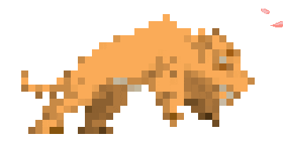

# I'm Joshua Joseph

## About Me

:shipit: Sophomore studying Computer Engineering @ [**University of Central Florida**][university] 
:shipit: Undergraduate Researcher @ [**UCF DRACO Lab**][DRACO] 
:shipit: Secretary @ [**UCF ACM**][UCFACM] 
:shipit: Fomer Technology Transfer Intern @ [**Sandia National Laboratories**][Sandia] 
:shipit: Building Quantum Circuits using ITensors.jl @ [**UCF's Physics Department**][UCFPHY] 
:shipit: Passionate about learning and creating an impact in my community

[UCFACM]: https://linktr.ee/acmucf
[university]: https://www.ucf.edu/
[DRACO]: https://www.ece.ucf.edu/DRACO/
[Sandia]: https://www.sandia.gov/
[QuantumCircs]: https://github.com/JoshInOnePiece/Quantum-Circuits-with-ITensor.jl
[UCFPHY]: https://sciences.ucf.edu/physics/

                    
## :seedling: Current Coursework :seedling:    
:computer: Computer Science 2
 
:hammer: Linear Circuits I
 
:file_folder: Computer Organization

:chart_with_upwards_trend: Statistics for Engineers

## :globe_with_meridians: Top Programming Languages :globe_with_meridians:

 
_Fun facts: My side interests include playing basketball, watching/reading One Piece, and helping out my local community!

    <b>Looking for a software engineering intern?
        <a href="https://www.linkedin.com/in/joshuavjoseph">Let's connect and talk!</a>
    </b>

---

<!---->

